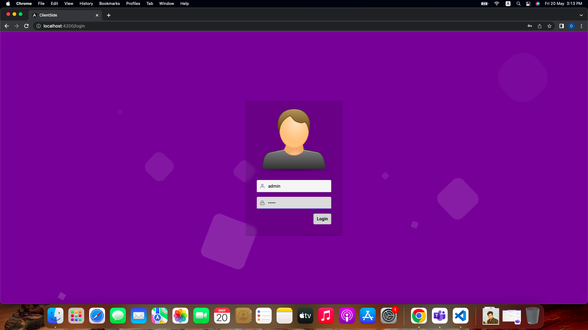

# ng-nest-jwt-client

## Screenshots

[](screenshots/screenshot-1.png)
[](screenshots/screenshot-2.png)
[](screenshots/screenshot-3.png)
[](screenshots/screenshot-4.png)
[](screenshots/screenshot-5.png)

## Development server

```bash
Run `ng serve` for a dev server. Navigate to `http://localhost:4200/`. The app will automatically reload if you change any of the source files.
```

## Build

```bash
Run `ng build` to build the project. The build artifacts will be stored in the `dist/` directory. Use the `--prod` flag for a production build.
```

## Running unit tests

```bash
Run `ng test` to execute the unit tests via [Karma](https://karma-runner.github.io).
```

## Running end-to-end tests

```bash
Run `ng e2e` to execute the end-to-end tests via [Protractor](http://www.protractortest.org/).
```
